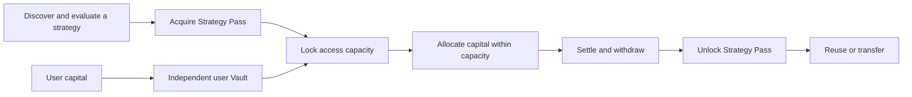

# AlphaForge

### Turn quantitative strategies into usable products while keeping access rights and user capital clearly separated.

**Creator Sets the Supply. Market Sets the Price.**

AlphaForge is a prototype for a public market of quantitative-strategy access rights.

Strategy creators define a fixed supply of **Strategy Passes**. Users can acquire those Passes, lock them when allocating capital to a strategy, and manage their own funds through an independent **Vault**. Once the corresponding principal is withdrawn, the released Passes can be reused or transferred.

The long-term goal is to make strategy access a transferable asset rather than a one-time subscription.

**X Layer Hackathon Edition**  
**Target Network: X Layer Testnet**

> **Current delivery:** a locally runnable product prototype, Strategy Pass and Vault smart contracts, and a chain-adapter foundation.
>
> The application runs in `Local / Mock` mode by default. It has not yet been deployed to X Layer Testnet. Market data, performance charts, Buy / Sell interactions, balances, and strategy execution are synthetic demonstrations and do not represent real transactions or historical performance.

[Why AlphaForge](#why-alphaforge) · [Core Model](#core-model) · [Product Experience](#product-experience) · [Three-Minute Demo](#three-minute-demo) · [X Layer Integration](#x-layer-integration) · [Local Development](#local-development) · [Delivery Scope](#delivery-scope)

---

## Why AlphaForge

Most quantitative-strategy products are sold as subscriptions, signals, or managed services.

Users may purchase access, but when they stop using the service, that access usually cannot be transferred to another user. The payment is consumed as a service expense, even when the underlying access could still be valuable.

AlphaForge explores a different model:

- Strategy creators define a limited amount of usable capacity.
- Users obtain that capacity through Strategy Passes.
- User capital remains separate from the access right.
- Unlocked Passes can be reused or transferred.
- A future secondary market can provide price discovery for strategy access.

The intended product flow is:

**Discover a strategy → Understand its assumptions → Acquire access → Allocate capital → Exit → Reuse or transfer access**

Transferability is a protocol feature, not a guarantee of liquidity. A Strategy Pass does not guarantee a buyer, preserve its value, or guarantee that the underlying strategy will be profitable.

---

## Core Model

### Access rights and user capital are separate

A Strategy Pass represents permission and capacity to use a strategy.

A Vault manages the user's capital.

They are not the same asset.



This diagram represents the intended product model. It does not imply that real strategy execution or a live secondary market is currently available.

| Object | What it represents | What it does not represent |
| --- | --- | --- |
| **Strategy** | A research method, its assumptions, observation frequency, risks, and failure conditions. | A promise of future returns. |
| **Strategy Pass** | A transferable access right and a defined amount of usable principal capacity. | Principal balance, ownership of a Vault, or automatic entitlement to strategy profits. |
| **Vault** | A user-owned capital container that records principal, allocation state, obligations, and withdrawal state. | A shared pool controlled by the strategy creator. |
| **Operation Record** | Evidence of requested, submitted, confirmed, failed, or cancelled operations. | Proof that an operation is complete merely because the interface received a response or transaction hash. |

### Capacity accounting

In the current protocol design:

- **1 PASS represents capacity for 1 AF-USDC of principal.**
- AF-USDC is a protocol test asset, not real USDC.
- The conversion describes usage capacity, not the market price of a Pass.
- Pass supply is fixed when the strategy is created.
- Additional Passes cannot be minted after deployment.
- Unlocked Passes support ordinary transfers.
- Depositing principal locks the corresponding Pass capacity.
- Locked Passes cannot be transferred.
- Profit does not consume additional Pass capacity.
- Withdrawing profit does not unlock Passes.
- A loss does not automatically unlock Passes.
- Withdrawing principal releases capacity according to the remaining principal.
- Fully closing the Vault releases the remaining locked Passes after protocol-accounted obligations are settled.

For example:

1. A user holds `100 PASS`.
2. The user allocates `100 AF-USDC` of principal.
3. The strategy simulation generates `50 AF-USDC` of profit.
4. The user withdraws `30 AF-USDC` of profit.
5. No Pass is unlocked because the original `100 AF-USDC` of principal is still allocated.

The Strategy Pass controls how much principal may use the strategy. It does not determine the size of any profit or loss.

### Ownership and authority

Vault ownership and strategy creation are separate roles.

The Vault owner must be explicitly defined. A strategy creator does not gain control over a user's Vault merely because the Vault is associated with that strategy.

In the intended production model:

- Wallet signatures authorize asset operations.
- Smart-contract state is the authority for ownership and capacity.
- Product accounts may link multiple verified wallets.
- Product accounts do not override on-chain ownership.
- Changing wallets does not silently transfer Vault ownership.

The current local demo uses Alice and Bob as simulated identities. These identities are not real wallet authentication.

---

## Product Experience

### 1. Strategy Market

The Strategy Market is designed for discovering and comparing strategies before acquiring access.

Users can:

- Browse trend-following, multi-factor, mean-reversion, and other strategy samples.
- Search by keyword.
- Filter by category.
- Save strategies.
- Compare strategies side by side.
- Open a ranking view.
- Review research assumptions and failure conditions.

The listed strategies are demonstration samples. They are not live financial products or deployed investment strategies.

### 2. Strategy Detail

The strategy page separates two concepts that are often incorrectly combined:

- **Strategy Pass price**
- **Strategy performance**

A rising Pass price does not mean the strategy itself produced the same return. Pass prices represent expectations and market demand for access, while strategy performance represents the simulated result of operating the strategy.

The current interface includes:

- Pass price candlestick charts.
- Strategy performance charts.
- Time-period controls.
- Open, close, high, and low values.
- Price change and percentage change.
- Trading range.
- Volume and turnover.
- Desktop hover interactions.
- Touch-based chart inspection.
- UTC timestamps.
- Explicit Mock data labels.

The page also includes a simulated Buy / Sell flow with:

1. Quote creation.
2. User confirmation.
3. Local submission.
4. Local receipt generation.

No real asset exchange occurs.

The simulated trading ledger is independent from the API Vault ledger.

### 3. Vault Workspace

The API workspace demonstrates how access rights and funds change through a strategy-use lifecycle.

The current local workflow supports:

- Claiming test Strategy Pass capacity.
- Adding simulated test funds.
- Allocating funds to a strategy.
- Removing an allocation.
- Starting a simulated strategy session.
- Stopping a simulated strategy session.
- Requesting a withdrawal.
- Confirming a withdrawal.
- Cancelling a pending withdrawal.
- Reviewing operation receipts.

The account interface separates:

- Available access capacity.
- Locked access capacity.
- Idle capital.
- Strategy allocations.
- Pending operations.
- Withdrawal state.
- Audit records.

Switching between Alice and Bob demonstrates local account isolation.

### 4. Open Notebook

Open Notebook provides a research-oriented community layer around each strategy.

It includes:

- Research notes.
- Replies.
- Saved posts.
- Personal workspaces.
- Strategy-related discussions.
- Failed experiments.
- Open research questions.

Current community content consists of demonstration samples and browser-local records. It is not a live online community.

### 5. Clear operation states

The interface distinguishes between:

- **Requested**
- **Submitted**
- **Confirmed**
- **Cancelled**
- **Failed**
- **Unknown or pending verification**

Receiving an API response or transaction hash does not automatically mean that a financial operation has been finalized.

This distinction is important for future wallet and blockchain integration.

---

## X Layer Integration

AlphaForge is being prepared for the X Layer Hackathon, with **X Layer Testnet** as the target deployment environment.

The product model remains unchanged:

- Strategy Passes represent access rights and capacity.
- Vaults manage user capital.
- On-chain state authorizes asset operations.
- Off-chain services provide product discovery, research content, charting, indexing, and user experience.

### Intended responsibility split

| Layer | Responsibilities |
| --- | --- |
| **On-chain** | Fixed Pass supply, Pass ownership, ordinary transfers, capacity locking, Vault ownership, deposit accounting, principal withdrawal, closing state, and protocol-authorized recovery operations. |
| **Off-chain** | Strategy discovery, research content, search, rankings, community interactions, charts, local execution simulation, event projection, and product analytics. |

### Current X Layer status

The repository contains smart contracts and a chain-adapter foundation, but the following X Layer work is not yet complete:

- X Layer Testnet deployment.
- Deployment-address registration.
- Runtime bytecode binding.
- End-to-end wallet validation.
- Network-switch validation.
- Real wallet signing.
- Transaction broadcasting.
- Transaction receipt verification.
- Target-network event indexing.
- Chain reorganization recovery validation.
- End-to-end Pass and Vault acceptance testing.
- External security review.

Existing local tests, contract tests, adapter tests, and previous network-oriented code do not constitute proof of a completed X Layer deployment.

Some directory names and governance documents still refer to the repository's earlier target-network work. They are retained until the X Layer migration is implemented and independently validated.

---

## Delivery Scope

| Module | Currently included | Not currently delivered |
| --- | --- | --- |
| **Product interface** | Home, market, strategy detail, ranking, account, forum, desktop charts, and touch interactions. | Live market data, real trading history, or a production community. |
| **Local simulation** | Fastify API, SQLite persistence, account isolation, operation receipts, allocation states, and withdrawal flows. | Real custody, real funds, wallet signatures, or blockchain settlement. |
| **Strategy Pass** | Fixed supply, initial allocation, ordinary transfer support, capacity representation, and lock integration. | Paid primary sales, live secondary-market settlement, or guaranteed liquidity. |
| **Vault** | Explicit owner authority, principal accounting, capacity constraints, deposit and withdrawal logic, closing logic, and recovery boundaries. | Production custody, externally audited fund management, or live strategy execution. |
| **Chain adapter** | Wallet-session abstractions, deployment validation logic, event-indexing logic, transaction-state verification, and recovery foundations. | Completed X Layer wiring, active testnet writes, and deployment acceptance evidence. |
| **Buy / Sell experience** | Local quote, confirmation, and receipt interactions. | Real Buy / Sell transactions, an AMM, an order book, or live price discovery. |
| **Strategy execution** | Local simulated start and stop workflows. | A complete strategy publishing service, a live execution venue, or production trading infrastructure. |
| **Security** | Unit tests, integration tests, browser tests, contract fuzzing, invariant-test entry points, and security scanning workflows. | An external audit, a bug-bounty program, or a guarantee that the system is free of vulnerabilities. |

### First-phase boundary

The first contract phase focuses on:

- Fixed-supply Strategy Pass creation.
- Initial Pass allocation.
- Ordinary Pass transfers.
- Capacity locking.
- Vault ownership.
- Principal accounting.
- Withdrawal and close behavior.
- Chain-adapter evidence handling.

The first phase does not include:

- Paid Pass issuance.
- Real Buy / Sell settlement.
- Automated market makers.
- Order-book trading.
- Strategy revenue distribution.
- Complete strategy execution.
- Real asset management.

---

## Local Development

### Requirements

Use the repository-pinned versions:

- **Node.js:** `24.21.0`
- **npm:** `11.19.1`

Environment requirements are documented in:

- [Development Toolchain](docs/DEVELOPMENT-TOOLCHAIN.md)
- [Implemented Toolchain Status](docs/DEVELOPMENT-TOOLCHAIN-STATUS.md)

### Start the demo

Run the following commands from the repository root:

```bash
node --version
npm --version
node tools/check-environment.mjs

npm ci --ignore-scripts
npm run demo
```

Open the local application using the address printed by the development server.

There is currently no public hosted demo.

`npm run demo` builds the frontend and starts the application with the `local / mock` configuration defined by `.env.example`.

A private key is not required.

### Local data

- API demonstration data is stored under `.data/`.
- Some interface state is stored in the current browser.
- Alice and Bob are local demonstration identities.
- Clearing local application data may reset parts of the demo.
- Mock Buy / Sell state and API Vault state are intentionally separate.

### Development checks

Run:

```bash
npm run check
```

This command includes consistency and evidence validation.

Missing evidence must be handled according to the project documentation. A failed evidence check must not be ignored or reported as passing.

---

## Implementation Overview

```text
apps/web/                  Product interface, charts, wallet UI, and product adapters
apps/server/               Fastify API, account simulation, and SQLite ledger
packages/domain/           Amount handling and Vault state logic
packages/chain-adapter/    Chain reads, event indexing, transaction verification, and recovery
packages/robinhood-chain/  Legacy target-network identity and configuration boundary
contracts/                 StrategyPass, Vault, PassLocker, and local contract validation
planning/                  Machine-readable roadmap, governance, and security boundaries
docs/                      Product, protocol, chain, security, and management documentation
```

The product interface uses:

- TypeScript
- Vite
- Native SVG charts

The local service uses:

- Fastify
- SQLite

The smart contracts use:

- Solidity
- Foundry

The repository includes entry points for:

- Unit tests
- Integration tests
- Browser tests
- Contract tests
- Fuzz tests
- Invariant tests
- Dependency checks
- Static analysis
- Security scanning

Exact test counts and completion percentages are intentionally not maintained in this README because they become stale quickly. Verification status should be taken from the relevant commit reports and CI evidence.

---

## Technical Documentation

### Protocol and accounting

- [Pass and Vault Accounting](docs/protocol/M3-PASS-VAULT-ACCOUNTING.md)
- [Phase 1 Contract Delivery](docs/protocol/PHASE1-CONTRACT-DELIVERY.md)

### Product and wallet flows

- [Phase 1 Product and Wallet Flows](docs/product/PHASE1-PRODUCT-WALLET-FLOWS.md)

### Chain adapter

- [Chain Adapter, Indexing, and Recovery](docs/M3-CHAIN-ADAPTER.md)

### Security

- [Security Policy](SECURITY.md)
- [Threat Model](docs/THREAT-MODEL.md)
- [Supply-Chain Security](docs/security/SUPPLY-CHAIN.md)

### Project status

- [Current Project Status](docs/management/CURRENT-STATUS.md)
- [Engineering Control Center](docs/management/dashboard/README.md)
- [Task Board](docs/TASK-BOARD.md)

The engineering control center is intended for project management. It is separate from the product demonstration.

---

## Security and Safety

- Never commit `.env` files containing secrets.
- Never commit wallet private keys.
- Never commit seed phrases.
- Never commit provider credentials.
- `.env.example` must contain public configuration only.
- The default application mode must remain local and non-custodial.
- Testnet writing must not be enabled merely by changing a network label.
- Deployment and transaction broadcasting require explicit review and validation.
- Local responses and transaction hashes must not be represented as final settlement without confirmation.
- Contract tests and local simulations do not replace a target-network acceptance test.
- The current prototype has not completed an external security audit.

This project is a software prototype.

It is not an investment product, does not provide financial advice, does not manage real funds, and does not guarantee strategy performance, Pass liquidity, or Pass value.

---

<details>
<summary>Repository governance records and preserved security constraints</summary>

## Current work

Governance decision status: **independent review (not accepted)**.

The canonical plan is [planning/roadmap.json](planning/roadmap.json). It generates [TODO.md](TODO.md), the [Markdown board](docs/TASK-BOARD.md) and the standalone [Chinese HTML security board](docs/task-board.html), so CI can reject status drift. Network assumptions and authoritative references are documented in [docs/ROBINHOOD-CHAIN.md](docs/ROBINHOOD-CHAIN.md). The proposed testnet scope and closed privilege baseline are documented in [ADR-0001](docs/adr/0001-testnet-mvp-scope-and-authority.md), with machine validation in [planning/security-boundary.json](planning/security-boundary.json). The generated [threat model](docs/THREAT-MODEL.md) records open risks without claiming they are fixed.

The active SUPPLY-001 work is documented in [docs/security/SUPPLY-CHAIN.md](docs/security/SUPPLY-CHAIN.md). Its offline check binds npm packages to the canonical registry and SHA-512 integrity, enforces the reviewed license and GitHub Action allowlists, and keeps the committed SPDX 2.3 SBOM synchronized with the lockfile. Vulnerability reports should follow [SECURITY.md](SECURITY.md).

GOV-001 acceptance evidence is tied to a real Git ancestor and a closed first-transition diff. Its repository validator can reject accidental or uncoordinated drift in the accepted ADR, this README's governance section, roadmap policy fields, the validator/tests and CI workflow while allowing roadmap lifecycle progress. The workflow invokes that validator and its tests directly instead of trusting mutable package-script indirection. Git provenance checks sanitize ambient Git configuration, ignore replace refs, distinguish an absent historical review file from an unreadable one, and reject reviewed commits dated after the verification instant.

This in-repository check is defense in depth, not its own trust root: one hostile commit could otherwise replace the workflow, validator and tests together. GOV-001 is therefore explicitly blocked on the current task, SUPPLY-001, which must establish a protected repository-external required workflow/status check and branch policy before governance can be accepted. In-repository reviewer IDs remain audit labels only; they are not external identity assurance. Both Testnet write planes remain closed.

</details>
